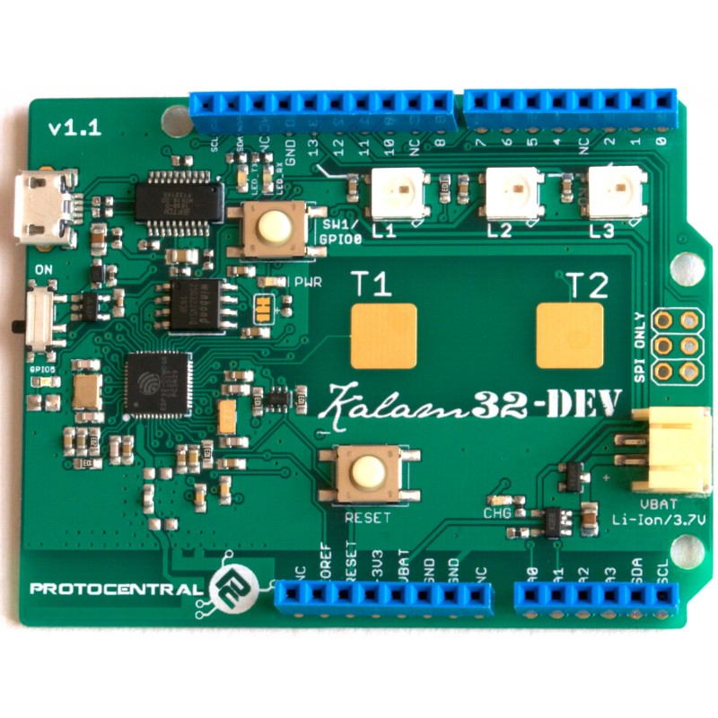

# ProtoCentral Kalam32-Dev ESP32 Wi-Fi and Bluetooth IoT platform
-------------------

[!
Dont have it yet? But one here: ProtoCentral Kalam32-Dev ESP32 Wi-Fi and Bluetooth IoT platform](https://www.protocentral.com/kalam-iot/1156-protocentral-kalam32-dev-esp32-wi-fi-and-bluetooth-iot-platform.html)

Meet the Espressif ESP32, a much-awaited sequel of the very popular ESP8266 SoC. This time around Espressif has given it a ton of integrated feature-rich peripherals. The CPU(s) is also upgraded with two individual cores from Tensilica, each running at up to 240 MHz. Two because one takes care of the Wi-Fi and Bluetooth stacks' computational requirements and the other one dedicated for the application.

This is just a lot of power waiting to be unleashed and still works on very low power for IoT applications. We are very excited with the capability of this chip and waiting to find more applications for it.

At the time of writing this document, the support for ESP32 in Arduino is still kind of patchy, however Espressif has an excellent development toolchain based on the Xtensa toolchain for Tensilica controllers. We love using Epressif's ESP-IDF toolchain and framework, it includes a great set of libraries. It works on Windows, MACOS and Linux. We use it on Ubuntu and it works like a charm.

Note: This product is still undergoing complete software testing for the various capabilities. Watch this page for more updates as we keep adding features in software for this.

Note: The Arduino core for ESP32 is still under development, so with the current state of the software, this board may not be a drop-in replacement for an Arduino. This feature should be available soon though.

##Features:

* On-board ESP32 System-On-Chip (SoC) featuring:
* Two Tensilica LX6 microcontroller cores running at 240 MHz, with 520 KB RAM !!
* Integrated Wi-Fi controller (802.11 b/g/n/i) up to 150 Mbps
* Integrated Dual-mode Bluetooth 4.2 controller ("classic" and Bluetooth low * energy (BLE) support)
* 12-bit SAR 12-channel ADC
* 8-bit, 2-channel DAC
* Capacitive touch sensor interface
* LED PWM controller
* CAN 2.0 controller
* Integrated temperature sensor
* Integrated Hall-effect sensor 
* Operating temperature range: -40 C to +125 C
* 4 MB on-board FLASH memory
* On-board 2.4 GHz PCB trace antenna for Wi-Fi/Bluetooth
* On-board FTDI FT231X USB-UART converter
* Operation from single Li-Poly battery with on-board charger and regulator
* 2x capacitive touch switches
* 3x WS2812B addressable RGB LEDs
* Arduino Uno compatible form-factor for addition of shields

Repository Contents
-------------------
* **/hardware** - All Eagle design files (.brd, .sch)
* **/docs** - Additional Documentation

License Information
-------------------
This product is open source!

Please use, reuse, and modify these files as you see fit. Please maintain attribution to Protocentral and release anything derivative under the same license.